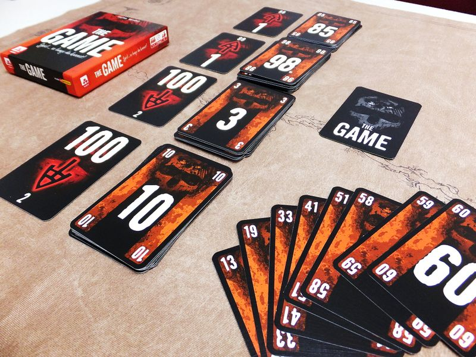

# Final Project

See example runs in files:
- _human_player_game.py_ for a single/multiplayer human game
- _random_agent_game.py_ for a single/multiplayer random agent game

File structure is as follows:
- _./logs_ holds all logs for runs. If no specific log-file is picked, then default is _run.log_
- _./the_game_ is the source code for the Game itself.
-- _./the_game/agents_ has the agents code. Soon to be added is the DQL agent
-- _./the_game/game_ has the game logic code.
-- _./the_game/env_ has the Environment code which runs as a middle-layer between agents and the game they play.

## Todos:
- [ ] Create DQN agent in _./the_game/agents/_
- [ ] Create _hint_ evaluation. (The priority of decks for each player)
- [ ] ...
